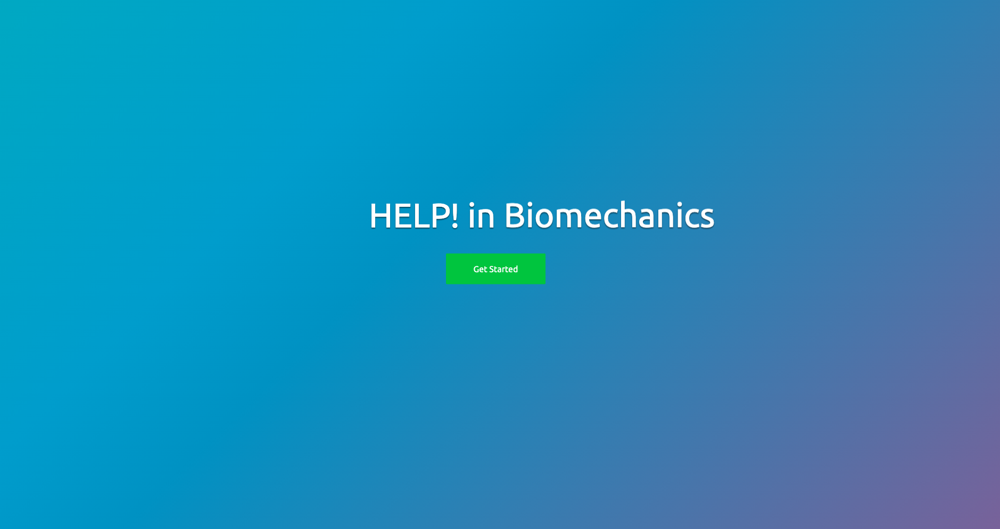
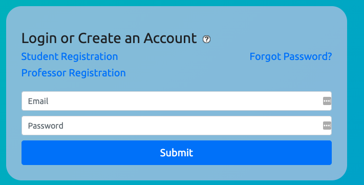
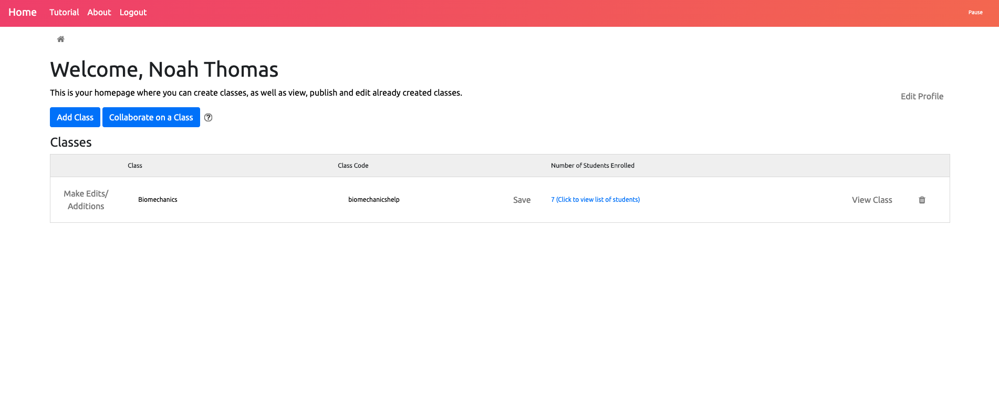
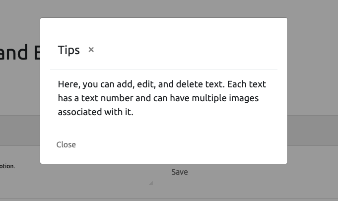
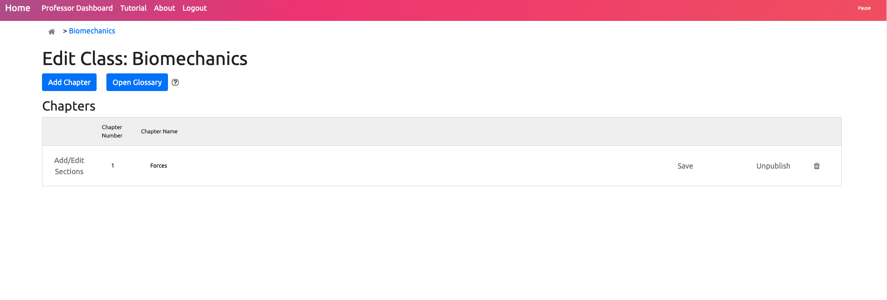
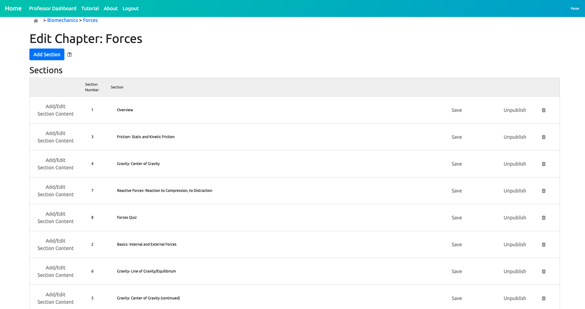
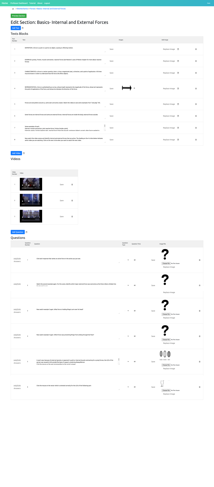

# HELP! The Higher Education Learning Program
Welcome to HELP, the Higher Education Learning Program! This project was created by [Braden Ash](https://github.com/ashbraden1), [Ricardo Barraza](https://github.com/rbarraza21), [Jack Riley](https://github.com/Jriles), and [Noah Thomas](https://github.com/n0ahth0mas) for the University of Puget Sound's Computer Science Capstone Class. The end goal of this project was to replace and update an online Biomechanics course created using a 1980s copy of Adobe Authorware. The current version of the system is up and running at [helppugetsound.com](helppugetsound.com), and can be tested by making a free account and enrolling in a demo class using the class code **DEMO**.

## Table of Contents

1. [Background](#background)
2. [Project Details](#details)
3. [Built With](#built)
4. [Authors](#authors)
5. [Acknowledgments](#ack)

<a name="background">

## Background
</a>

Due the the nature of the University of Puget Sound's Occupational Therapy Program, students often found themselves needing review for a handful of introductory biomechanics topics. However, because each student needed to review a different topic, there was no way the instructor  could refresh them on every topic.

Thus, the original Help! program was born. The instructor of this course created a multi-part review system covering all introductory topics essential to the students' success in the program using [Adobe Authorware](https://en.wikipedia.org/wiki/Adobe_Authorware). This multimedia study tool quizzed students on different biomechanical functions by asking them to watch certain clips of the Beatle's movie [Help!](https://en.wikipedia.org/wiki/Help!_(film)) and analyze what was happening in their bodies.

This software was uploaded onto 8 Power Macintosh Computers. However, almost 30 year later, only one of these computers remains semi-functional.

In late Fall 2020, the instructor asked Computer Science students to develop a more modern and flexible version of this software, resulting in this project, the Higher Education Learning Program (HELP).

<a name="details">

## Project Details
</a>

After taking all of the client's needs into account, this project was developed with flexibility in mind - rather than statically creating and populating a website, professors can dynamically create courses with chapters, sections, and questions. Each page can flexibility hold text, images, videos, and a quiz. Each quiz is populated with any combination of multiple choice, short answer, drag and drop, and point and click questions.

### Login and Account Creation

Users are immediately greeted with a dynamic home screen, highlighting some of the many use cases with this program. After entering the site, users are prompted to either create or login to an account. There are two account types: student and professor. Students can only enroll in classes, while professors can manage, create, and collaborate on these classes. This site is also equipped with password management, allowing users to reset their password via automated email.

| HELP Splash Screen  | Login Page |
| ------------- | ------------- |
|  |   |

### Professor Home

Professors and students are each welcomed to the app with a home screen, allowing them to view their list of classes, along with basic profile editing functionality. Every professor view is also populated with question mark blocks, showing tip popups explaining how to perform actions relevant to the content of the page. Professors can also access a full tutorial from the navbar at any time.

| Professor Home Page | Tip Popup Example |
| ------------- | ------------- |
|  |   |

### Creating Classes, Chapters, and Sections

Once a professor navigates to the class they want to edit, they are presented with the edit class page. Each class is made up of a set of chapters, which is made up of a set of sections. Each chapter and section must be published in order for students to be able to see that content. This allows professors to create content ahead of the time they want to roll it out to their students.

| Edit Class Page| Edit Chapter Page |
| ------------- | ------------- |
|  |   |

Professors can also edit sections. The section page is where the students will spend most of their time using the program, and as previously stated, holds a flexible amount of content. A section page is broken into 3 blocks: text, video, and quiz, in that order. Each section can hold an unlimited amount of content. A screenshot of the edit section page can be seen here, as the image is too long to be visible in this readme.

<a name="built">

## Built With
</a>

<a name="authors">

## Authors
</a>

<a name="ack">

## Acknowledgments
</a>
