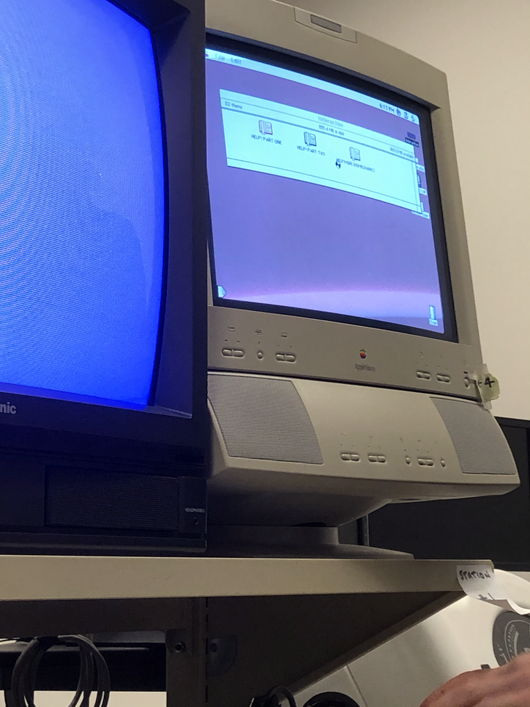

# HELP! The Higher Education Learning Program
Welcome to HELP, the Higher Education Learning Program! This project was created by [Braden Ash](https://github.com/ashbraden1), [Ricardo Barraza](https://github.com/rbarraza21), [Jack Riley](https://github.com/Jriles), and [Noah Thomas](https://github.com/n0ahth0mas) for the University of Puget Sound's Computer Science Capstone Class. The end goal of this project was to replace and update an online Biomechanics course created using a 1980s copy of Adobe Authorware. The current version of the system is up and running at [helppugetsound.com](helppugetsound.com), and can be tested by making a free account and enrolling in a demo class using the class code **DEMO**.

## Table of Contents
[Background](#background)
[Project Details](#details)
[Built With](#built)
[Authors](#authors)
[Acknowledgments](#ack)

<a name="background">

## Background
</a>
Due the the nature of the University of Puget Sound's Occupational Therapy Program, students often found themselves needing review for a handful of introductory biomechanics topics. However, because each student needed to review a different topic, there was no way the instructor  could refresh them on every topic.

Thus, the original Help! program was born. The instructor of this course created a multi-part review system covering all introductory topics essential to the students' success in the program using [Adobe Authorware](https://en.wikipedia.org/wiki/Adobe_Authorware). This multimedia study tool quizzed students on different biomechanical functions by asking them to watch certain clips of the Beatle's movie [Help!](https://en.wikipedia.org/wiki/Help!_(film)) and analyze what was happening in their bodies.

This software was uploaded onto 8 Power Macintosh Computers. However, almost 30 year later, only one of these computers remains semi-functional.

In late Fall 2020, the instructor asked Computer Science students to develop a more modern and flexible version of this software, resulting in this project, the Higher Education Learning Program (HELP).

<a name="details">

## Project Details
</a>

<a name="built">

## Built With
</a>

<a name="authors">

## Authors
</a>

<a name="ack">

## Acknowledgments
</a>
